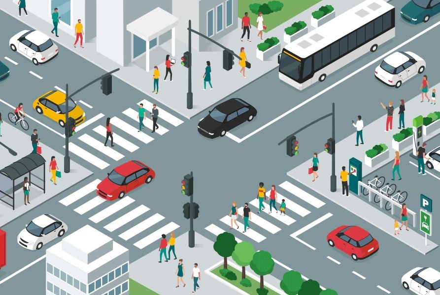

<link rel="apple-touch-icon" sizes="180x180" href="/apple-touch-icon.png">
<link rel="icon" type="image/png" sizes="32x32" href="/favicon-32x32.png">
<link rel="icon" type="image/png" sizes="16x16" href="/favicon-16x16.png">
<link rel="manifest" href="/site.webmanifest">
<link rel="mask-icon" href="/safari-pinned-tab.svg" color="#5bbad5">
<meta name="msapplication-TileColor" content="#da532c">
<meta name="theme-color" content="#ffffff">

<!-- 

  

      <ul class="nav">
          <li><a href="{{ BASE_PATH }}/broman_cv.pdf">cv</a></li>
          <li><a href="https://github.com/kbroman">github</a></li>
          <li><a href="https://kbroman.org/blog">blog</a></li>
          <li><a rel="me" href="https:///fosstodon.org/@kbroman">mastodon</a></li>
      </ul>
  

 -->

  NJIT OptiML-Lab

<table class="wide">
<tr>
  <td class="figure">	
    
  </td>
</tr>
</table>

At OptiML-Lab, we utilize optimization theory, machine learning and domain specific knowledge to develop innovative 
computational methods that are scalable and reliable. With main applications in power systems,
transportation systems, and supply chains, our research provide innovative solutions that help large-scale industrial systems 
to operate in a safe and economic way.

<!-- <table class="wide">
<tr>
  <td class="left">
    
  </td>
  <td class="right">
    
  </td>
</tr> -->

### Projects

  

    <a href="publpics/cyber-security.html" class="hover-effect">
      
      
Grid Cybersecurity

    </a>
  

  

    <a href="publpics/demand-response.html" class="hover-effect">
      
      
Grid Flexibility

    </a>
  

  

    <a href="publpics/transportation.html" class="hover-effect">
      
      
Transportation Systems

    </a>
  

  

    <a href="publpics/supply-chain.html" class="hover-effect">
      
      
Circular Supply Chains (CSC)

    </a>
  

<!-- 

  

      <ul class="nav">
          <li><a href="morefigs.html">more figures</a></li>
      </ul>
  

 -->

