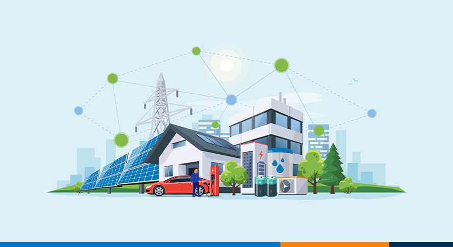
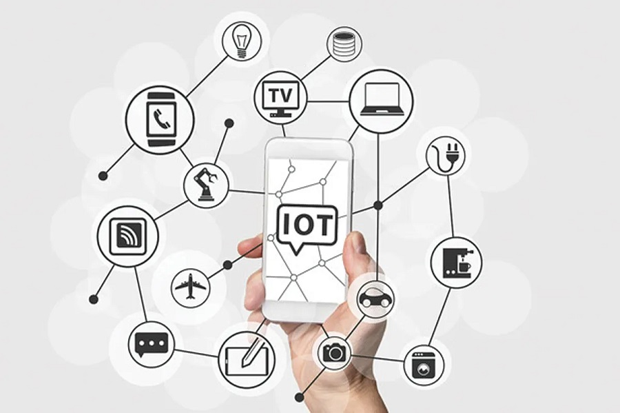
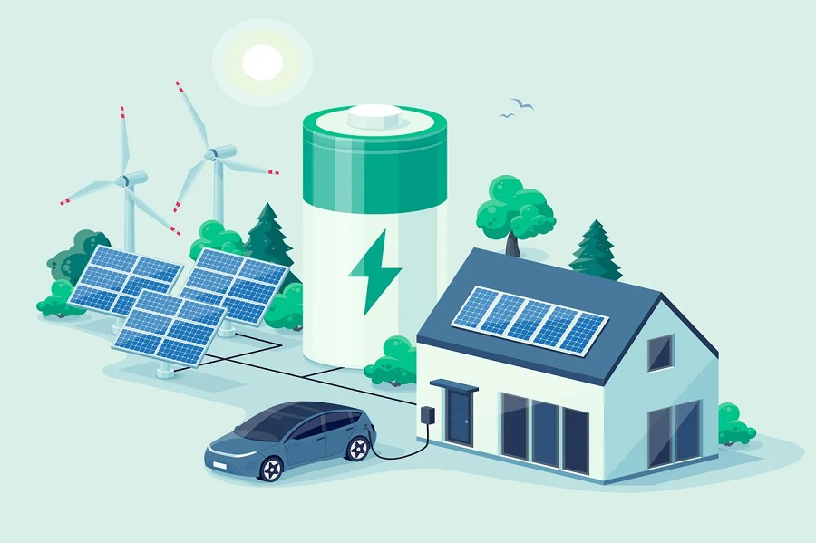

<link rel="apple-touch-icon" sizes="180x180" href="/apple-touch-icon.png">
<link rel="icon" type="image/png" sizes="32x32" href="/favicon-32x32.png">
<link rel="icon" type="image/png" sizes="16x16" href="/favicon-16x16.png">
<link rel="manifest" href="/site.webmanifest">
<link rel="mask-icon" href="/safari-pinned-tab.svg" color="#5bbad5">
<meta name="msapplication-TileColor" content="#da532c">
<meta name="theme-color" content="#ffffff">

<!-- 

  

      <ul class="nav">
          <li><a href="{{ BASE_PATH }}/broman_cv.pdf">cv</a></li>
          <li><a href="https://github.com/kbroman">github</a></li>
          <li><a href="https://kbroman.org/blog">blog</a></li>
          <li><a rel="me" href="https:///fosstodon.org/@kbroman">mastodon</a></li>
      </ul>
  

 -->

<table class="wide">
<tr>
  <td class="figure">	
    
  </td>
</tr>
</table>

At OptiML-Lab, we utilize optimization theory, machine learning and domain specific knowledge to develop innovative 
computational methods that are scalable and reliable. With main applications in power systems and 
transportation systems, our research provide innovative solutions that help large-scale industrial systems 
to operate in a safe and economic way.

<table class="wide">
<tr>
  <td class="left">
    
  </td>
  <td class="right">
    
  </td>
</tr>

<!-- 

  

      <ul class="nav">
          <li><a href="morefigs.html">more figures</a></li>
      </ul>
  

 -->

  
NJIT OptiML-Lab

