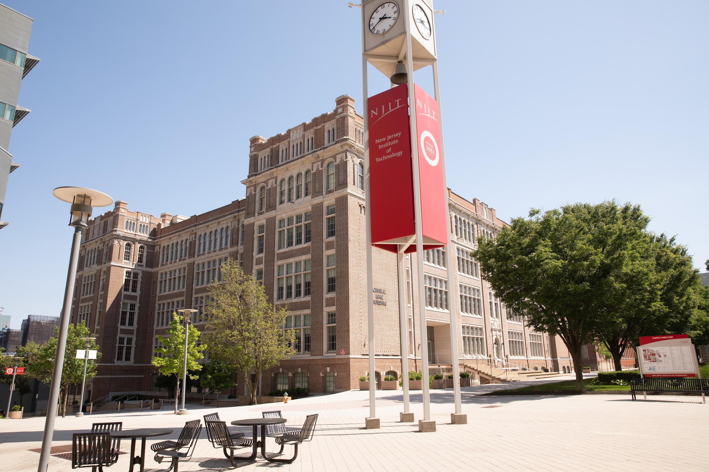
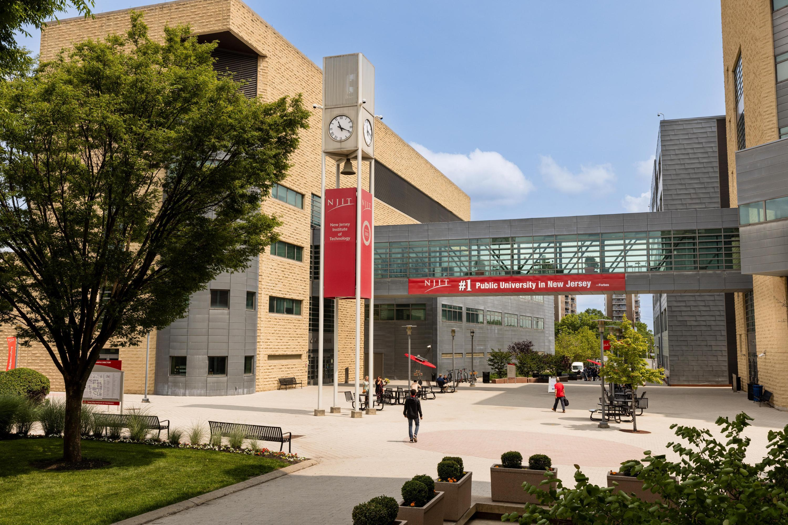
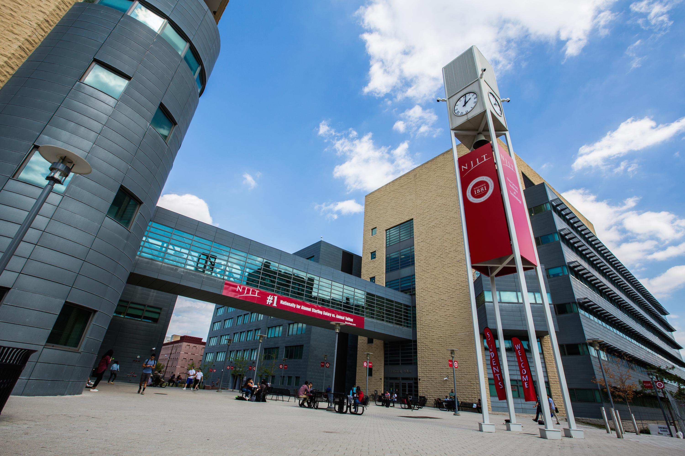
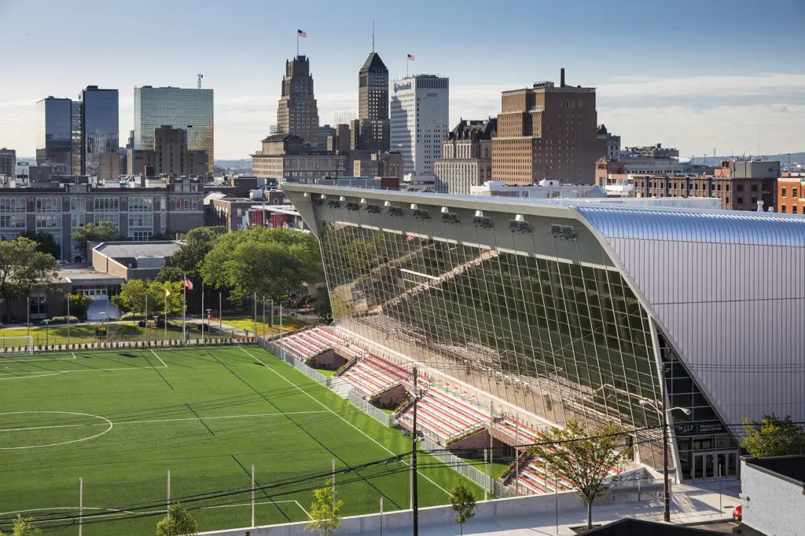
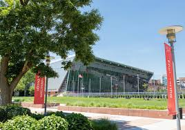

  

    
    
    
	
	
	
    <!-- Add more images as needed -->
  

  <button class="prev-button" onclick="changeFigure(-1)">&lt;</button>
  <button class="next-button" onclick="changeFigure(1)">&gt;</button>

* August 2022: I have joined the [New Jersey Institute of Technology](https://www.njit.edu/) as an Assistant Professor.

* April 2022: I have successfully defended my dissertation and received my Ph.D. from UC Berkeley IEOR.

* July 2020: Our paper [“Homotopy Method for Finding the Global Solution of Post-contingency Optimal Power Flow”](https://ieeexplore.ieee.org/document/9147711)
has won the Best Student Paper Award of 2020 American Control Conference (ACC).

* April 2019: I received the [Marshall Oliver-Rosenberger Fellowship](https://ieor.berkeley.edu/announcing-the-fall-2019-grassi-mor-fellows/) from the Department of IEOR, UC Berkeley.

* March 2019: I was nominated by the Department of IEOR, UC Berkeley to receive the 2018-2019 Outstanding Graduate Student Instructor Award.

* September 2018: I successfully passed the Doctoral Qualifying Examination and advanced to candidacy.

* November 2016: I joined Professor [Javad Lavaei’s group](https://lavaei.ieor.berkeley.edu/Group.html) at [UC Berkeley IEOR](https://ieor.berkeley.edu/) as a PhD student.

* May 2016: I graduated from [Johns Hopkins University](https://www.jhu.edu/) with a B.S. in Environmental Engineering.