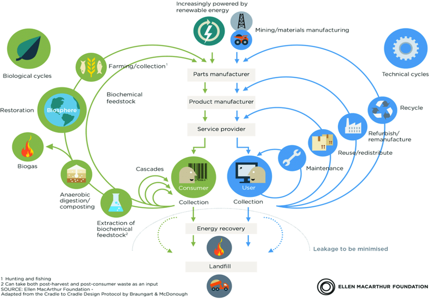

### Circular Supply Chains: Quantifying their Resilience in the Face of Disruptions

<table class="wide">
<tr>
  <td class="figure">	
    
  </td>
</tr>
</table>

As illustrated by the 2030 Agenda for Sustainable Develop-
ment and the Paris Agreement on Climate Change, the EU
is committed to consistently progressing towards sustainable
industrial practices. Circular economy (CE) is a sustainable
economic paradigm that aims at prolonging the resource value
as long as feasible, by promoting the continuous reuse of
resources and products, recapturing value from by-products
and end-of-life resources, and minimising resource leakage
out of the systems. Circular Supply Chain (CSC) is a self-
regenerative ecosystem adopting the principles of Circular
Economy to extract new value from end-of-life resources,
extend material life, and increase resource efficiency toward
zero-waste operating conditions. CSCs extend the boundaries
of closed loop supply chains (SCs) by involving multiple
stakeholders, with both firms belonging to the linear supply
chain stages and organizations from the external industrial
networks, carrying out the circular activities. Several exam-
ples have been provided by previous works, where recycled
polyethylene terephthalate (PET) bottles and textile materials
may be used for construction or waste cooking oil from
a food supply chain utilized to produce bio-fuels. Despite
the highly-anticipated benefits of CSCs, the current literature
on the topic is rather limited and invites further studies.

In this project, we propose a general framework for analyzing
the resiliency of CSCs. Without a doubt, CSC networks
should be resilient to better perform in the advent of fre-
quent and unpredictable disruptions. Similar to linear supply
chains, the stability of CSC networks can be jeopardized
by adverse events that can occur at different levels, for
instance, within each facility (e.g. warehouse), within single
firms (intrafirm), between different firms (inter-firm), and at
the global level. Machine malfunctioning, natural disasters
(earthquakes, volcano eruptions), terrorist attacks, political
turbulence, economic crises, and diseases (Covid-19, SARS)
are just a few examples

Acknowledging the ripple
effect of disturbances, we develop a framework that models
the dynamics and equilibrium state of a supply chain and offer
an exact algorithm for computing the new equilibrium state
of CSC after a disruption. Using this methodology, we are
able to accurately analyze the resilience of CSC in the face
of different types of disturbances occurring when handling,
storing and transporting materials. Moreover, we provide a
measure that quantifies the benefits of CSC when compared
to linear supply chains. Using this framework, we are not
only able to assess the resilience of existing CSCs but also
determine which nodes (e.g. warehouse, firm) and arcs (e.g.
connection, flow, operation) are the most important contribu-
tors to the resilience of the network. Finally, the metric can
also be readily used to assess future investments/expansions
on material handling systems of the existing supply chain
network.