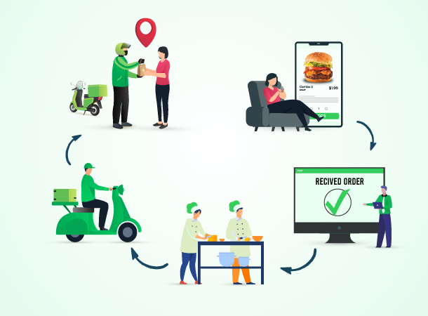

### Multi-Pickup and Delivery of Restaurant Orders: A Graph-Aware Reinforcement Learning Approach

<table class="wide">
<tr>
  <td class="figure">	
    
  </td>
</tr>
</table>

The Multi-Pickup and Delivery Problem with Time
Window (MPDPTW) is an essential optimization
problem in transportation and logistics, with
significant real-world applications in today’s fast-paced
environment. This research addresses the challenging
task of optimizing multiple restaurant order pickups
and deliveries, leveraging the power of graph-aware
reinforcement learning (RL). By integrating advanced
artificial intelligence techniques, this study aims to
address the dynamic and complex logistics within the
food service industry. The primary goal is to enhance
service delivery efficiency, mitigate time lags, and
reduce operational expenses. Through the application
of a graph-aware RL model, we aim to create a
resilient, adaptable system that continually learns and
improves from environmental interactions, thereby
refining the decision-making process in the context
of multiple restaurant order pickups and deliveries.
This study provides a fresh perspective on the role of
deep learning in revolutionizing food service logistics,
making a significant contribution to the growing
domain of intelligent and automated delivery systems.
We explore graph representation learning to tackle the
MPDPTW complexity and to improve the efficiency and
effectiveness of transportation and logistics systems.